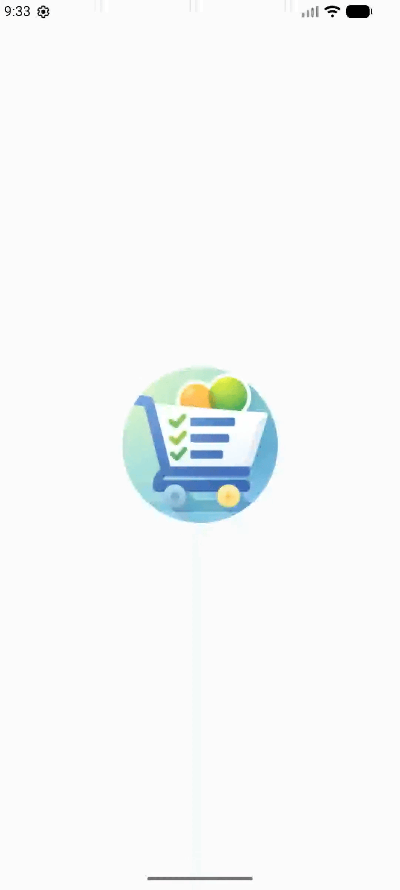

# 🛒 Shopping List App

<p align="center">
  A modern Shopping List Android application built with <b>Jetpack Compose</b> and <b>Material 3</b>.
</p>

<p align="center">
  
  
  
  
  
</p>

---

## ✨ Overview

**Shopping List App** is a clean and intuitive Android application that allows users to manage shopping items efficiently.

Built entirely with **Jetpack Compose**, the app demonstrates modern Android development practices, smooth animations, and a clean Material 3 UI design.

---

## 🎥 Demo

<p align="center">
  
</p>

---

## 🚀 Features

- ➕ Add items instantly
- ✏️ Inline item editing
- ✅ Mark items as completed
- 👆 Swipe left to delete (animated)
- 🧹 Clear entire list
- 🌙 Light & Dark theme support
- ⚡ Smooth UI animations
- 🧩 Clean composable architecture

---

## 🛠 Tech Stack

- **Kotlin**
- **Jetpack Compose**
- **Material 3**
- **LazyColumn**
- **SwipeToDismissBox**
- **AnimatedVisibility**
- **Compose State Management**

---

### Design Principles

- Separation of UI blocks into reusable composables
- Stable keys to prevent recomposition issues
- Animation-driven interactions
- Clean and readable code structure

---

## 📦 Getting Started

### Clone the repository

```bash
git clone https://github.com/yourusername/shopping-list-app.git
```
---

## Open in Android Studio

- Android Studio Hedgehog or newer recommended
- Run on emulator or physical device

---

## 📱 Requirements

- Android 8.0 (API 26+)
- Kotlin 1.9+
- Gradle 8+

---

## 📄 License

This project is licensed under the MIT License.
